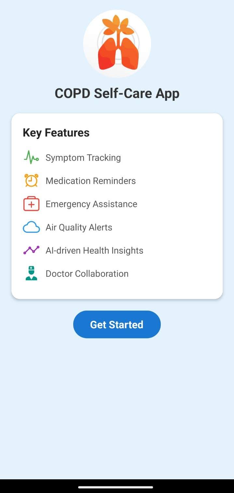
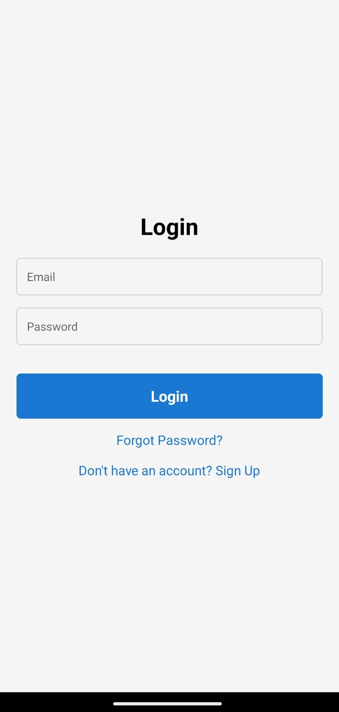
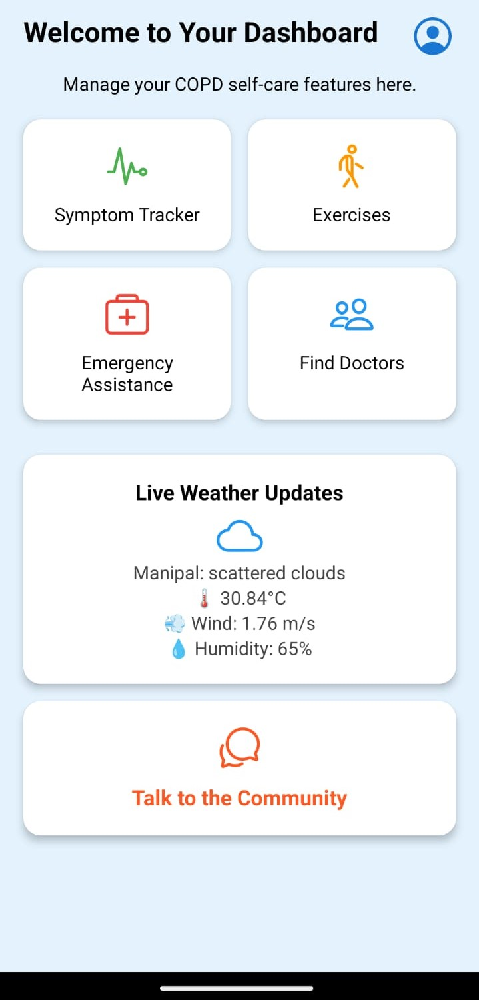
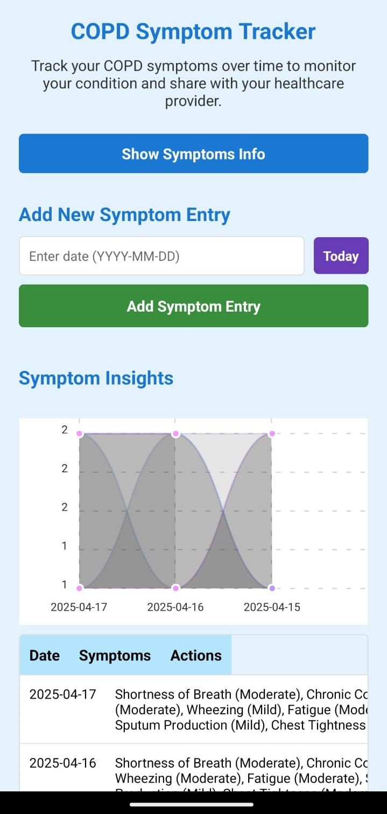
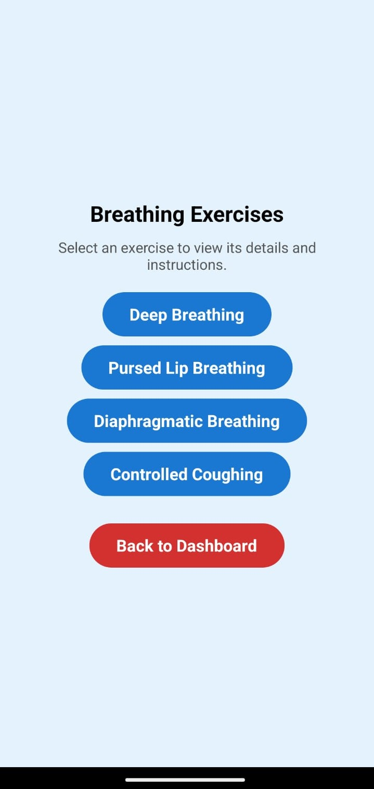
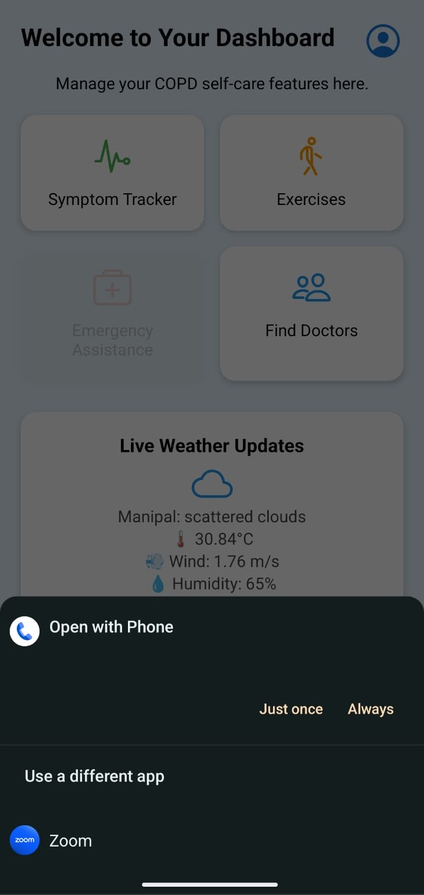
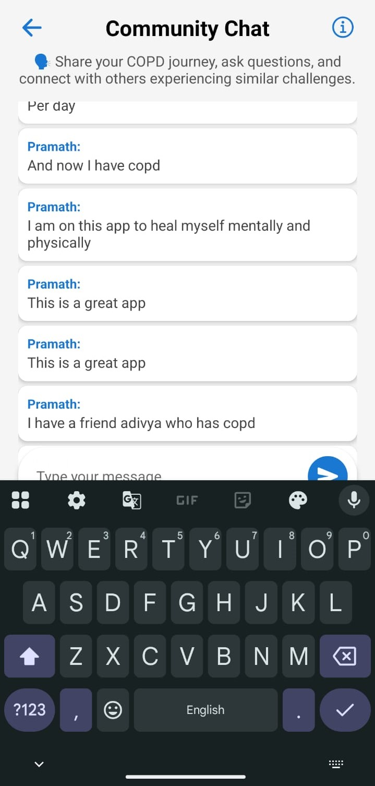
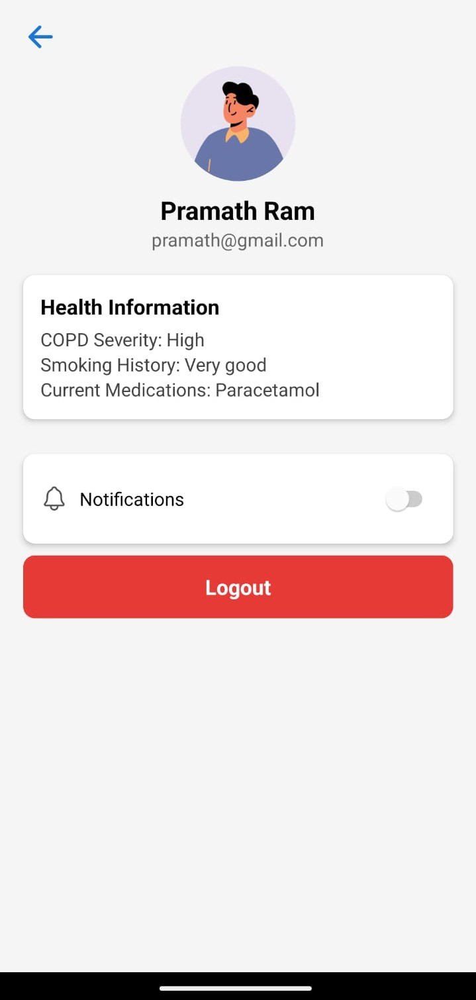

# 🫁 COPD Care App

A mobile application built using **React Native (Expo)** and **Google Firestore**, designed to help users manage Chronic Obstructive Pulmonary Disease (COPD) by tracking symptoms, connecting with doctors, and providing educational and community support.

---

## 📱 Features

- 🔐 **User Authentication** (Firestore)
  - Login, Register, and Profile Management

- 📊 **Symptom Tracker**
  - Track daily symptoms (e.g., breathlessness, coughing, fatigue)
  - View weekly summary in **Bar Chart** format (AsyncStorage)

- 📍 **Find Doctors Near You**
  - Fetches user location to display nearby COPD specialists

- 💬 **Community Chat**
  - Real-time support and discussion with other users via Firestore

- 📞 **Emergency Contact**
  - Quick access button to call ambulance during symptom flare-ups

- 🧘 **Exercise Module**
  - Tailored routines for COPD symptom relief and lung function

---

## 🛠️ Tech Stack

- **React Native with Expo**
- **Firebase Authentication & Firestore**
- **AsyncStorage** for local data

---

## 📸 Screenshots

<div style="display: flex; gap: 10px;">
  
  
  
  
  
  
  
  
  
</div>

---

## 🚀 Getting Started

### Prerequisites

- Node.js
- Expo CLI
- Firebase project setup

### Installation

```bash
git clone https://github.com/yourusername/copd-care-app.git
cd copd-care-app
npm install
npx expo start
